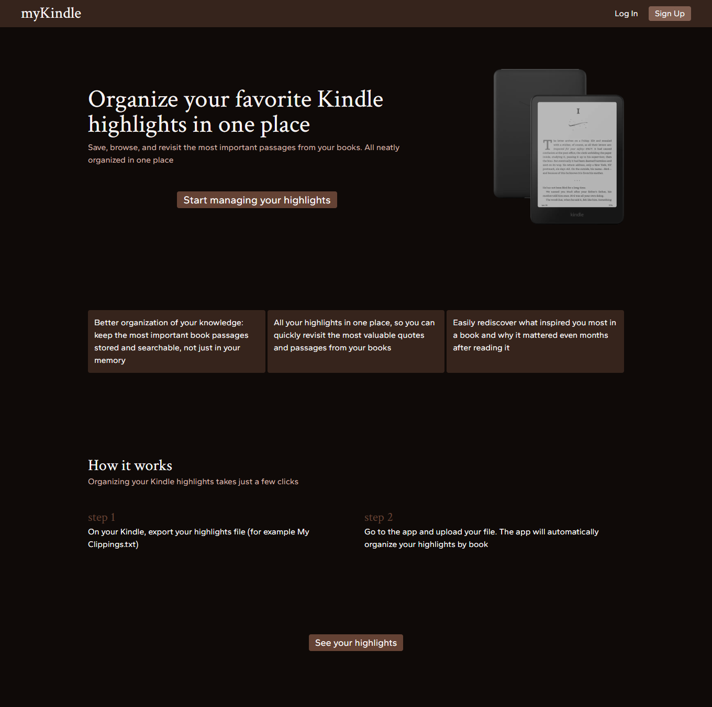

# 📙 myKindle

The application **allows users to import Kindle highlights** and then automatically parses the data, extracting the book title, author, highlights, and their metadata. **All data is stored** in a PostgreSQL database hosted in Supabase

The web application enables users to **create an account using an email address and password**, **verify the account using email message**, and **reset the password** through an automatically sent link. Users can also **log in using Google or GitHub**

All Kindle highlights are unified in one place and organized by books. **Users can search books and highlights and sort them**, and application is designed to be responsive so that it works on computers, tablets and phones

[**➥ Live**](https://my-kindle-highlights-app.vercel.app)

## ⚙️ Technologies

## ⭐ Features

- **Create user account** using email and password
  - **Confirm account** creation using email verification
  - **Reset password** through email message
- Login with **Google** or **GitHub**
- **Import** your Kindle highlights
- **Automatic parsing** imported data
- **Storage data** in database (PostgreSQL in Supabase)
- **Organize** Kindle highlights from multiple devices in one place
- **Search** books and highlights
- **Sort** books and highlights

## 🔎 See Also

[My Website](https://pj-portfolio-cv.vercel.app/)  
[My GitHub profile](https://github.com/OKE225)
